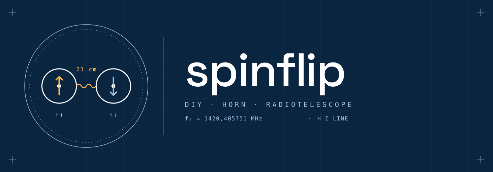

<picture>
  <source media="(prefers-color-scheme: dark)"  srcset="docs/img/spinflip-lockup-paper.png">
  <source media="(prefers-color-scheme: light)" srcset="docs/img/spinflip-lockup-blueprint.png">
  
</picture>

# spinflip

A hydrogen line (21 cm) spectrometer built with an RTL-SDR dongle. Captures
radio signals at 1420,405 MHz, averages multiple FFT frames to reduce noise,
and plots the resulting power spectrum in dB.

Inspired by [CHART](https://github.com/astrochart/CHART) — the Completely
Hackable Amateur Radio Telescope project.

Spinflip is also a personal learning project in two senses: understanding radio
astronomy by building rather than just reading about it, and exploring how
Claude (Anthropic) can work as a genuine collaborator in real software
development. The code, tests, and documentation were developed with Claude
throughout.

## Hardware

- RTL-SDR Blog V4 dongle
- SAWbird+ H1 LNA (provides ~40 dB amplification at the hydrogen line — centred on 1420,405 MHz)
- A suitable antenna or dish pointed at the sky

## Dependencies

### System

Build and install `librtlsdr` from source — the version shipped by most
distros is too old to work with the Python driver:

```bash
sudo apt install cmake libusb-1.0-0-dev
git clone https://github.com/osmocom/rtl-sdr.git
cd rtl-sdr && mkdir build && cd build
cmake .. && make && sudo make install && sudo ldconfig
```

### Python

Requires Python 3.14+ and [Poetry](https://python-poetry.org/):

```bash
poetry install
```

## Usage

**Quick start** — hardcoded defaults, plots immediately:
```bash
poetry run python src/radio_telescope/capture.py
```

**With a config file** — `observe.py` supports three modes depending on your
config:

*Single observation* (default) — captures one averaged spectrum and saves it:
```bash
cp config.example.toml config.toml   # edit azimuth, elevation, telescope name…
poetry run python src/radio_telescope/observe.py config.toml
```

*Campaign mode* — runs observations back-to-back for a set duration, saving
each as a separate FITS file in a shared campaign folder. Set `duration_s` in
the `[observation]` section:
```toml
[observation]
duration_s = 3600   # run for one hour
```

*Frequency scan* — sweeps the SDR across a band and stitches the steps into
one wide-band spectrum. Add a `[scan]` section:
```toml
[scan]
start_mhz = 1418.0
stop_mhz  = 1424.0
step_mhz  = 2.0
```

**Graphical interface:**
```bash
poetry run python src/radio_telescope/gui.py
```

`config.example.toml` at the repo root documents all available options with
comments. You can keep multiple named configs (e.g. `zenith.toml`,
`galactic_plane.toml`) and pass whichever you need to `observe.py`.

## How it works

The dongle is tuned 1 MHz above the hydrogen line (1421,405 MHz) so the line
of interest appears as an offset peak rather than at DC zero, which RTL-SDR
hardware cannot accurately represent. The 2 MHz sample rate gives a 1 MHz
window on either side of the tuned frequency.

100 frames of 262 144 IQ samples are captured. Before each FFT, a
Blackman-Harris window is applied to taper the block edges to zero, preventing
spectral leakage from strong nearby signals bleeding into the hydrogen line
bin. The resulting power spectra are averaged (`spectral averaging`), which
reduces broadband noise while preserving the consistent real signal. The
result is displayed with frequency in MHz on the x-axis and power in dB on
the y-axis.

Each observation is saved as a FITS file containing three data units:

| HDU | Name | Contents |
|-----|------|----------|
| 0 | (primary) | Averaged power spectrum in dB |
| 1 | `FREQS` | Frequency axis in MHz |
| 2 | `TIMESTAMPS` | Unix timestamp per integration (UTC) |

A `config.toml` is saved alongside the FITS file so every observation folder
is self-contained and reproducible.

## OS compatibility

This project was developed and tested on Linux. Other platforms have not been tested.

- **macOS** — likely works. Replace the `librtlsdr` build steps with `brew install librtlsdr` and install the USB driver via [rtl-sdr-blog](https://github.com/rtlsdrblog/rtl-sdr-blog).
- **Windows** — untested. `librtlsdr` requires [Zadig](https://zadig.akeo.ie/) to install the WinUSB driver before the dongle is accessible from Python. Build instructions differ significantly.

Contributions with tested instructions for other platforms are welcome.

## Compatibility note

`pyrtlsdr` 0.4.0 references symbols (`rtlsdr_set_dithering`, GPIO functions)
that may be absent in some `librtlsdr` builds. `sdr_compat.py` patches
`ctypes.CDLL` at import time so missing symbols become silent no-ops. This
approach was chosen to avoid modifying the installed library and to keep the
fix within the project's own code.

## License

GPL-3.0-or-later — see [LICENSE](LICENSE).  
Developed with assistance from Claude (Anthropic) — see [NOTICE](NOTICE).
